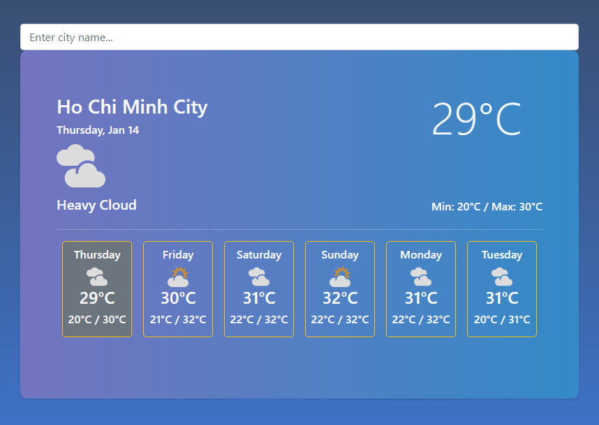
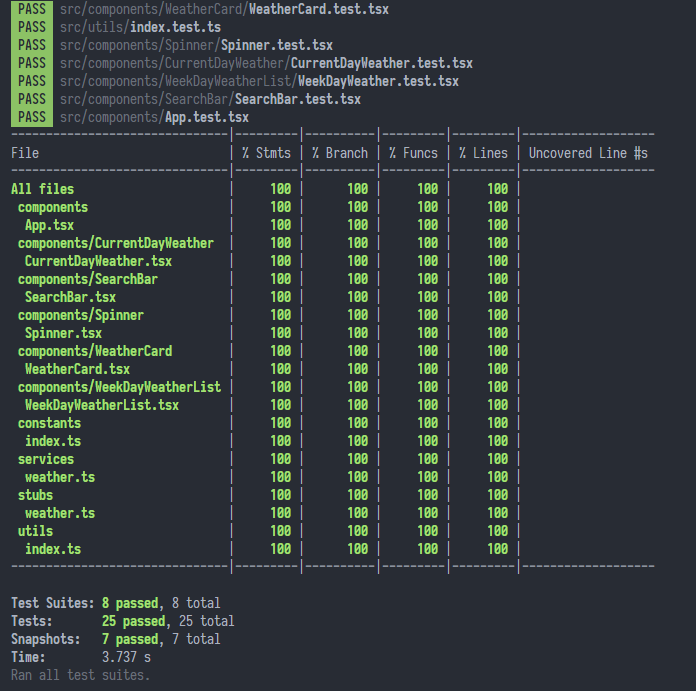

# Weather App  

Weather App is a React App for displaying weather forecasts

## Demo

[https://weather-app-cuong.netlify.app](https://weather-app-cuong.netlify.app)

## Built with

- [React](https://reactjs.org/)
- [MetaWeather](https://www.metaweather.com) API
- [Github Actions](https://github.com/features/actions) + [Netlify](https://www.netlify.com/) CI/CD

## Preview

## Usage

### Requirements

- [Node](https://nodejs.org) >= 12
- [yarn](https://yarnpkg.com) v1

### How to start

- Clone the repository
- Run `yarn install`
- Run `yarn start`
- Open [http://localhost:3000](http://localhost:3000) in browser

## Test

- Run `yarn test`
- For coverage, run `yarn test:cover`

